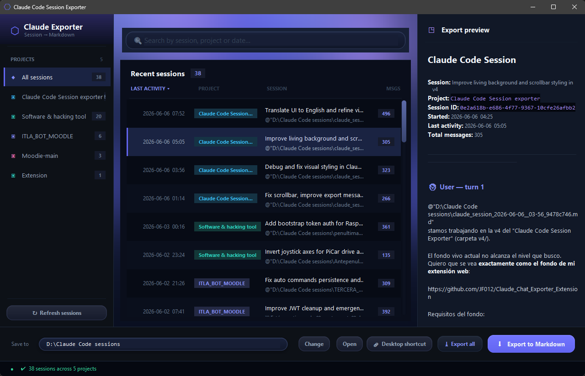

<p align="center">
  
</p>

<h1 align="center">Claude Code Session Exporter</h1>

<p align="center">
  
  
  
  
</p>

<p align="center">
  <strong>Export your Claude Code sessions to Markdown with a clean GUI.</strong>
</p>

A lightweight desktop app that scans your local Claude Code sessions, lets you pick one, and
exports the whole conversation to a tidy `.md` file — perfect for handing context to a **new**
session so Claude picks up where you left off, or for keeping a readable archive of your work.

Ships as a **standalone `.exe`** (no Python required) or runnable from source. Everything runs
locally and reads straight from your `.claude` folder — no servers, no cloud.

---

## ⬇️ Download

**[Download ClaudeSessionExporter.exe](releases/ClaudeSessionExporter.exe)** &nbsp;·&nbsp; Windows · standalone · no install

1. Download the `.exe` from the [`releases/`](releases/) folder.
2. Double-click it — no Python, no setup. The app opens with no console window.
3. On first launch it offers to create a Desktop shortcut (one-click access).

> The executable is self-contained (PyInstaller `--onefile`). The hexagon icon is embedded,
> so it shows in the taskbar and on the file itself.

---

## 🖥️ Run from source

```bash
# Clone
git clone https://github.com/JF012/Claude_Code_session_exporter.git
cd Claude_Code_session_exporter

# Run (Windows, no console window)
pythonw claude_exporter_gui-3.pyw
```

### Requirements (source only)
- **Python 3.8+**
- **No external dependencies** — `tkinter` ships with the standard Python installer.

---

## 📸 Screenshot



---

## ✨ Features

- **Smart session detection** — Scans your local `.claude/projects/` and lists only the *active*
  sessions, de-duplicating restarted/duplicate conversations like Claude Code's own "Recents".
- **Real project & session names** — Reads the actual project path and session title from each
  session file, so the grid shows clean names (e.g. `Moodie-main`) — full path on hover.
- **Clean Markdown export** — User turns, Claude replies, tool calls and system notes are laid
  out as readable Markdown, saved to a folder you choose.
- **Glassmorphism dark UI** — Deep indigo gradient header, translucent panels, zebra-striped data
  grid, focus-highlighted inputs and a live status bar.
- **Live search & sort** — Instant filtering by name, project or date, plus click-to-sort columns.
- **Desktop shortcut** — Optional one-click launcher with the app icon (Windows).

---

## 🧠 How It Works

| Step | What happens |
|:-----|:-------------|
| 1. Scan | Finds `~/.claude/projects/` and reads every `*.jsonl` session file |
| 2. Parse | Extracts the real project path, session title, timestamps and message count |
| 3. De-duplicate | Collapses restarted/duplicate conversations — keeps the most recent |
| 4. Display | Lists active sessions in a sortable, searchable data grid |
| 5. Export | Renders the selected session to Markdown in your chosen folder |

### Where sessions are found

| OS | Path |
|:---|:-----|
| Windows | `%USERPROFILE%\.claude\projects\` (and `%APPDATA%\Claude\`) |
| macOS | `~/.claude/projects/` (and `~/Library/Application Support/Claude/`) |
| Linux | `~/.claude/projects/` |

---

## 🛠️ Tech Stack

| Technology | Purpose |
|:-----------|:--------|
| **Python 3** | Language / runtime |
| **tkinter + ttk** | GUI, custom widgets and the Treeview data grid |
| **tkinter.Canvas** | Glassmorphism gradient header |
| **PyInstaller** | Standalone `.exe` packaging |
| **PowerShell** *(Windows)* | Creates the Desktop `.lnk` shortcut |
| **base64** | Embedded application icon |

---

## 📄 License

Open source, available for educational and personal use.

---

<p align="center">
  Made with 🐍 Python by <a href="https://github.com/JF012">JF012</a>
</p>
